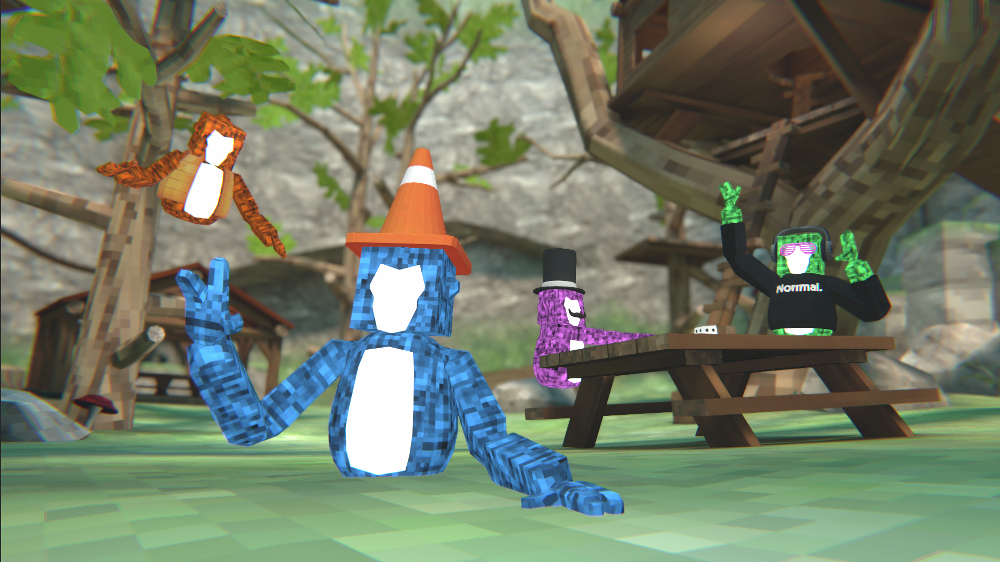
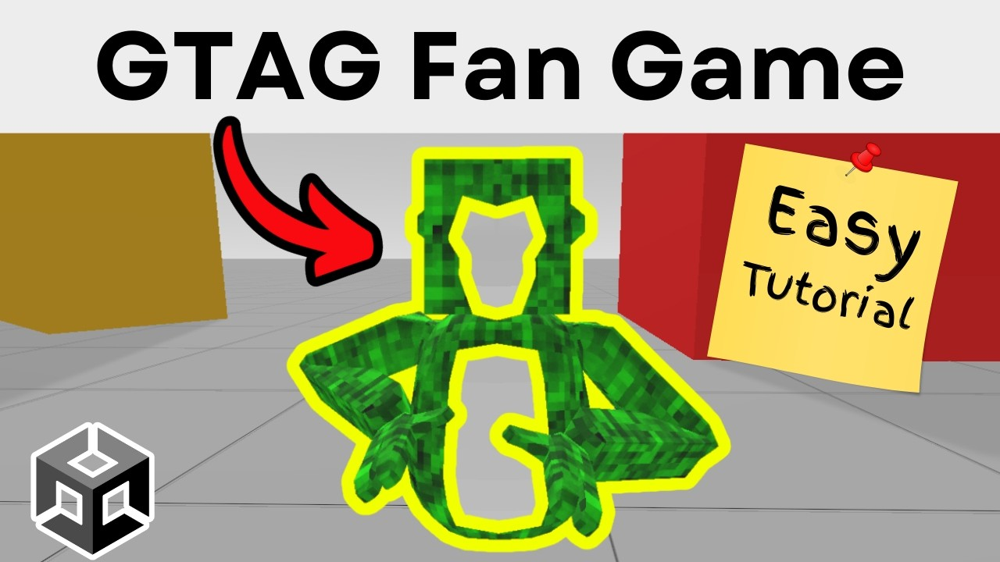

# Gorilla Template

Meta Quest games like **Gorilla Tag**, **Yeeps**, and **Animal Company** are now making **$100,000,000+ in revenue every year**. This template gives you everything you need to create your own.

Need a feature for your game that's missing? Join our [Discord](https://discord.gg/aSfYnfhtE3) and we'll add it for you!

### Features
- Multiplayer
- Unity 6 Support
- [Gorilla Locomotion](https://github.com/NormalVR/GorillaLocomotion)
- Smooth and snap turn
- Finger animations
- Haptics
- Infection Game Mode
- Climbing
- Mirror
- Room Selector
- Nametags
- Mute / Unmute
- Leaderboard
- Cosmetics (in-progress)
  - Color switcher
  - Items (in-progress)
  - PlayFab (in-progress)
- Grabbable objects (in-progress)
- In-App Purchases (in-progress)

### Getting Started
1. [Download](https://github.com/NormalVR/GorillaTemplate/archive/refs/heads/main.zip) a copy of the template.
2. Open the GorillaTemplate folder with [Unity](https://unity.com/download).
3. In Unity, open the scene `Assets/_GorillaTemplate/_DemoScenes/Demo (Multiplayer).unity`.
4. Create a [normcore.io](https://normcore.io/?utm_source=github&utm_medium=referral&utm_campaign=gtag) account and generate an App Key.
5. [Copy the App Key](https://docs.normcore.io/essentials/getting-started?utm_source=github&utm_medium=referral&utm_campaign=gtag#create-an-app-key) into the `Realtime` component.
6. Enter Play Mode or Export a build for your device.

### Discord
Need help? Have a feature request? Join our discord! https://discord.gg/aSfYnfhtE3

### Tutorials
Have you created a YouTube tutorial or TikTok? Let us know in [Discord](https://discord.gg/aSfYnfhtE3) and we'll feature it right here!

<a href="https://www.youtube.com/watch?v=cYANUINPako">
  
   
  How to Make a Gorilla Tag Fan Game in 5 Minutes 👍
</a>
